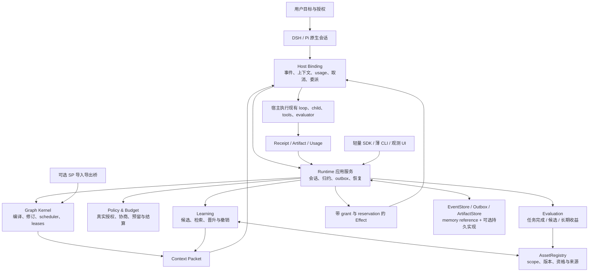
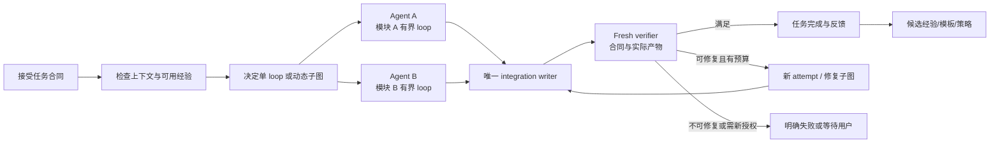
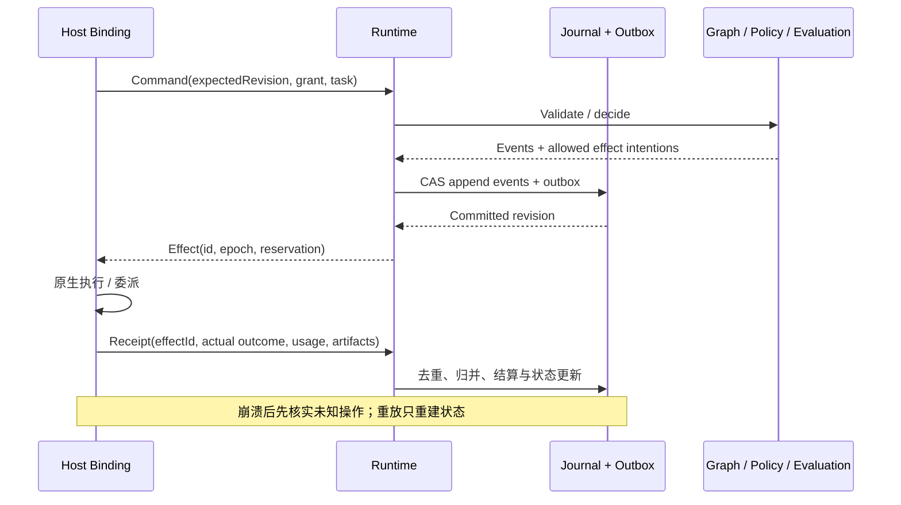
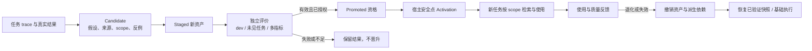

# EvoFence 重构架构提案：Graph Engineering 驱动的能力演化内核

设计日期：2026-10-01。状态：**待人审，尚未实施**。图：`evofence-harness-kernel`，工作类 `program`。

本轮授权是完整重构思考与图设计，止于交人审。本文是架构提案；图源、context 和 proposed ADR 由 super-plumber 管理。旧源码、配置、ledger、集成、Skills 和历史图未因此获得修改授权。

## 1. 要交付的产品

EvoFence 成为嵌入 DSH 与 Pi 的能力演化内核。它在日常长程编码任务中组织有界 agent loops，选择什么时候独立探索、什么时候协作、什么时候验证与修复，并把经过验证的有效做法变成后续任务可复用的能力资产。

用户已确认的设计方向：

1. 嵌入 harness 的能力演化内核。
2. 长程编码与多 agent 协作结合。
3. 全面重设，允许 breaking change。
4. 演化策略、经验、代码、技能和工具候选，暂不包含模型权重训练。
5. DSH 与 Pi 同等首发。
6. 宿主执行，内核决策；可显式委托子图。
7. 授权范围内自主执行与验证晋升。
8. 双宿主实用闭环与受控能力收益是最终标准。
9. 按任务动态生成和修订受约束子图，复用已验证模板。

以下实现方案和 ADR 仍是供审阅的提案；上述方向确认不等于实施批准。

## 2. 当前架构为什么支撑不了这个目标

本 checkout 是 `d47f88367564e65db026b43b4b1e4fd83f06a4b7`，package 与 CHANGELOG 标注 0.4.2。本轮未核实 npm 发布状态。

当前真实路径：加载 `.evofence`/Git → detached worktree 测基线 → 子 CLI 生成 proposal → 子 CLI 实现代码 → 收集本地 shell 证据 → 比较一个数值目标 → 裁决 → Git commit/generation → 串行下一轮。

| 源码事实 | 产品限制 | 新架构责任 |
|---|---|---|
| `src/index.ts:8` 已有库 API，主要入口是整体 `runEvolution` | 宿主难以只接入反馈、候选评价、激活或恢复阶段 | 独立会话应用服务与 typed ports |
| `exec/runner-preflight.ts:51` 强绑定 Git 和本地策略目录 | 非代码策略、经验和工具资产都被挤进 repository diff | TaskContract、WorkspacePort、AssetRegistry |
| `exec/runner-iteration.ts:45` 通过 worktree 和 proposal 文件交互 | 已有 harness 会话与上下文被换成子进程协议 | HostPort 与原生 lifecycle binding |
| `exec/runner-run.ts:32` 串行循环 | 没有动态协作图、资源所有权和完整分支验收 | 图编译器、scheduler、租约与 fan-in |
| `exec/runner-evaluate.ts:73` 单目标 delta 门槛 | “完成修复任务”与“长期能力提高”混在一起 | 分离 TaskVerdict、EvaluationReceipt、Promotion、Activation |
| `lib/gate/index.ts:34` 明示多项纯 gate 未接生产路径 | 只抽新 facade 仍可能保留两套判定 | 唯一生产裁决服务与纵向 wiring 核验 |
| `exec/runner-context.ts:23` RunState 在内存 | ledger 审计不等于 durable workflow | journal、投影、outbox、reconciliation |
| `lib/ledger/driver.ts:4` 静态加载 native SQLite | 普通宿主 import 也携带本机原生依赖 | core 与可选 storage implementation 分离 |
| `integrations/deepseek-harness/index.js:40` 两个只读 tools | 安装成功不能变成 DSH 实用闭环 | DSH session 与团队执行 binding |
| `lib/exec/adapter-args.ts:80` Pi 子 CLI 关闭 session/资源发现 | 无法利用用户当前会话与长期资源 | Pi 原生 extension 与 SDK child session |

旧代码仍有值得带入新设计的原则：产物绑定精确 base、证据与实际 diff 一致、缺失用量不装成零、明确隔离强度、可追溯裁决与可撤销产物。允许 breaking 并不要求抛弃这些原则。

配置说明存在差异：0.4.2 CHANGELOG 将 network/dependency_install/credentials 写为 context echo；源码仍对声明请求调用动态 capability 判断。准确事实是**声明请求可判断，未声明实际使用没有检测信号**。新设计必须区分这两种事实。

## 3. Graph Engineering 在这里的准确含义

产品运行图组织多个有界 agent loops、确定性代码、工具操作与独立验证器。输入、输出、类型边、共享状态、资源所有权、路由和停止条件成为可执行合同。图可动态扩展；任务复杂度不够时允许只有一个 loop。

这与官方对 agent graph 的说明一致：节点可以包含完整 agent，边描述状态转移；运行图可能有循环和动态分支，不能一律视为静态 DAG。[Graph Engineering 原文](https://www.langchain.com/blog/3-years-of-graph-engineering-with-langgraph)

本提案区分三件事：

| 图 | 负责什么 | 真相源 |
|---|---|---|
| 本轮 super-plumber 重构图 | 实施阶段、领域边界、契约、决策、人审和验收依赖 | `.graph/evofence-harness-kernel/` |
| EvoFence 产品执行图 | 运行时 agent nodes、数据流、控制路由、资源与 attempt | 新版 runtime journal + GraphRevision |
| 能力资产来源关系 | 哪些经验/模板/工具由哪些证据产生、依赖、激活或撤销 | AssetRegistry 与不可变 evidence references |

第二项是 Graph Engineering 主线。第三项服务于跨任务学习与归因，不预设图数据库或 GraphRAG。第一项是本轮设计工具，不能因它存在就声称产品已有 graph runtime。

借鉴 SP：类型边、context、契约、ADR、完成证据、交接与派生视图。明确不照搬：YAML writer 模型、提示性审核凭据、仅标注的迭代边，以及 CLI/MCP 分发方式。SP 的审核字段是记录和提示；产品授权必须由实际 policy 和宿主权限根裁决。[Super Plumber 官方仓库](https://github.com/LUKAWI/super-plumber)

## 4. 整体组件与责任

| 领域 | 拥有的决策 | 不拥有的权力 |
|---|---|---|
| Contract | schema、身份、错误、数据流合同 | 调度或执行 |
| Graph | 拓扑合法性、ready、资源租约、修复与 fan-in | 工具权限或 agent 进程 |
| Runtime | 会话状态、effects、恢复与反馈归并 | 扩大宿主权限 |
| Host | 原生执行、身份、实际使用与取消 | 证明未评测的收益 |
| Policy | grant、预算与 required guarantee 判断 | 未观测行为的虚假保证 |
| Store | journal、CAS、产物内容与派生投影 | 业务裁决 |
| Evaluation | 唯一任务/候选/能力裁决 | 修改资产或代码 |
| Learning | 提炼、检索、资格变更与激活事务 | 替自己的候选证明收益 |
| Surface | 用户/机器入口和派生观测 | 第二份状态机或 gate |

权威保持单一：内核执行图是其决策真相；host team board 是宿主执行投影或经明确映射的权威。不能让两个 scheduler 同时认领同一节点。

## 5. 单任务内的实际工作

典型输入是用户的真实任务，例如“修复一次跨模块接口变更并补齐相应验证”。它无需用户先写单数字 objective shell command。

图生成可以是一个宿主 model effect，也可以采用模板与确定性编译。模型提出 GraphPatch；kernel 先验证，再以 expected revision 原子提交。动态生成不能直接获得权限或跳过任务必需分支。

并发策略：读任务可并行；互不相交的 write scopes 才可并行写。共享基准代码由 WorkspacePort 管理；各 worker 产物绑定 base。integration writer 串行整合；冲突返回 rebase/replan，不盲合并。fresh verifier 有独立 context，不仅复读执行者的“完成了”。

所有必须分支都有终态与证据；若要放弃一条分支，需修改任务合同/图 revision 并保存理由。失败、取消、超预算不会在汇总时消失。

代码是一个产物类型。经验/策略/模板节点无需 Git。技能和工具候选先生成新版本 staged asset；不改用户已有全局 Skills。安装或执行新工具取决于当前宿主 grant。

## 6. 图和 agent loop 的组合

GraphSpec 的节点可为 `agent`、`tool`、`deterministic`、`evaluate`、`join`、`human` 或 `subgraph`。agent 节点包含宿主原生 loop，而不是每次模型调用都另造一个图节点。

| 边/约束 | 可执行语义 |
|---|---|
| dependency | 前置状态与输入产物满足后才 ready |
| data | 指定 artifact 身份、schema、可见性和消费方式 |
| route | 根据 typed result 选择后继；禁止未声明任意执行 |
| repair / retry | 新 attempt 或新子图，有次数、总时间、总费用和深度上限 |
| fallback | 在定义失败条件下转用可用路线，保留原失败证据 |
| resource | 对 workspace、integration writer、能力指针或外部对象授予排他/共享租约 |
| provenance | 资产或结论的来源关系，不能意外成为 ready 门禁 |

依赖投影保持无环，控制路由允许有界循环；不能把整个产品图强行做成 DAG，也不能让 repair 绕过资源总账。SP 本轮实施图无环是交付顺序约束，与产品运行图的循环语义不同。

图修订约束：

- 只修改尚未认领的节点，或先取消/收回并产生新的执行 attempt。
- 被执行节点输入和产物 binding 不可悄悄变化。
- 每次修订重新检查完整性、权限、资源、fan-in、预算与可终止性。
- 图 revision、节点 attempt、session epoch、lease fencing token 分离。
- 被取消/过期 worker 的迟到回包仍可归档，但不能影响新状态或被重复记账。

## 7. 会话、持久化与副作用

建议采用确定性 state reducer 加应用服务。`Command → 验证 → 原子追加 Event 与 Effect intention → Host 执行 → Receipt → 归约`。

journal 与 outbox 原子提交；宿主回执可重复送达但只应用一次。外部操作的 exactly-once 不能普遍保证：执行后回执前崩溃时，状态是 `unknown`，通过 reconciliation 核实真实状态，再决定重试、补偿或等待用户。不是根据缺失 receipt 自动重放命令。

新增 schema/namespace，不原地改旧 ledger。memory implementation 用于 reference 与合同核验；持久实现是独立依赖。SQLite 是可审阅的首个本机方案，不是内核必需依赖；确切并发与事务方案在 L1 定案。

初期范围是本机、同一用户信任域的多 agent。跨机器分布式执行、云端权限和多租户服务需要另立目标；接口预留不代表已实现。

## 8. 让限制变得有意义

新 policy 以 task requirements 和真实 grant/observability 决定边界。普通任务不因缺少演化所需保证就必然无法执行。

| 情况 | 合理行为 |
|---|---|
| 任务只需原生 tools 与会话 | 使用宿主已授予权限，单 loop 或图均可运行 |
| 缺少可靠 cost，但没有要求美元硬预算 | 明确用量未知或仅估计，采用已支持的时间/请求限制 |
| 要求美元硬上限，宿主仅后验估价 | 不声称满足硬上限；提供可验证的替代预算策略或等待用户决策 |
| 宿主缺少安全取消/恢复，任务要求这些保证 | 明确 unsupported，不能假装 conformance |
| 演化存储或评价故障 | 禁止未证实晋升，普通宿主任务可继续 |
| candidate 想增加权限、发布或做破坏性操作 | 进入实际授权流程，graph patch 不提供授权 |

预算预留覆盖 planner、worker、verifier、learning 和 evaluation；parent/child 共享总账。成本来源区分 measured、estimate、unknown；API 估价不是最终账单，后验阈值不是 request-time hard cap。

工具 hooks 只能保证被这些 hooks 覆盖的工具路径。它们不等于 OS sandbox，也不能发现所有 shell 内部实际操作。若任务要求更强隔离，必须有对应环境能力；不要用 capability 声明或 worktree 冒充。

## 9. 跨任务演化的实际闭环

“记住文本”不是完成标准。资产必须有版本、适用条件、来源、evaluation receipt、依赖与失效规则；下一任务记录检索了什么、实际用了什么、多耗费多少上下文。模型/宿主/仓库变更会使资格需要重新核验。

第一版检索可用确定性 metadata 筛选与排名；先证明使用经验带来价值，再决定是否需要向量库、图检索或更复杂学习器。演化应覆盖图拆分模板、worker/verifier配置、工具选择、上下文计划和修复策略，而不只积累“提示词技巧”。

在线临时调整、任务产物接受、长期资产晋升与宿主激活是四个独立动作。授权内的晋升可以自动；审核触发器写入预授权规则，不能靠每次人工批准掩盖内核无实用性。

## 10. 双宿主首发路径

DSH 和 Pi 都需要 session binding、delegation adapter 与实际场景证据。

官方资料提供实现入口：DSH 的 `tools/pre-execute` 和 agent context/团队服务可作为探针起点；Pi 的 extension 事件和 `appendEntry` 提供会话接入与自定义状态。这里只证明有文档依据，尚未证明目标版本和我们的实现可用。[DSH extension cookbook](https://github.com/deepseek-ai/deepseek-harness/blob/master/docs/cookbook/extension-cookbook.md)、[Pi extensions](https://github.com/earendil-works/pi/blob/main/packages/coding-agent/docs/extensions.md)

Pi 的子 agent 由适配层根据已核验 SDK 能力实现，不假定它自带 DSH 的同型 team board。两个宿主 API 可不同，任务、证据、授权和恢复合同必须相同。不能把一个宿主的条件不足悄悄改成第二阶段接入。

必须验证当前官方 Pi 中 `agent_end` 与 `agent_settled` 的区别，目标版本若没有后者则明确映射安全点；`agent_end` 不被直接当作所有后续活动结束。[Pi agent-session 源码](https://github.com/earendil-works/pi/blob/main/packages/coding-agent/src/core/agent-session.ts)

## 11. 验收与收益

三层证据互不替代：

1. **机制成立**：生产 wiring、并发所有权、完整 fan-in、取消、usage、恢复、晋升与撤销有合同证据。
2. **实用闭环成立**：两个宿主各自原生完成真实长程编码/多 agent 任务和跨任务学习场景。
3. **能力收益成立**：两个宿主各自通过资源匹配、未见任务、预注册指标的对照与消融。

对照组 A：原 harness；B：图编排无长期演化；C：图编排加长期演化。尽量保持同模型/版本、tools、prompt资源与总 token/USD/时间上限，记录各组实际用量；规划、评测与学习花费也在总账。每组在相同任务与种子上配对，且不能让 baseline 因人为删减工具而变弱。

主指标和最小有价值阈值在 L1 人审冻结。例如优先 task success/质量，费用和完成时间作约束，采用配对差异与区间；具体样本量由可辨识收益、任务方差和实验预算决定，不在无数据时编造数值。对失败、超时、缺失 usage、负结果和 `inconclusive` 均如实报告。终审集合与验证反馈不能被用于继续选候选。

收益不成立时，L4/L5 不以“全部代码写完”宣称目标实现；据证据删减或改造无价值机制。这是研究产品的判断点。

## 12. 重构方式与交付阶段

采用五个阶段带，level 不表示依赖深度。详细节点见 [ROADMAP.md](ROADMAP.md)。

| 阶段 | 目标 | 进入下一阶段的证据 |
|---|---|---|
| L1 | 人审目标、双宿主能力探针、图语义、评测合同与接口定案 | 未知毕业证据与增量人审；当前设计不是实施批准 |
| L2 | 协议、graph/scheduler/policy、journal/ports/runtime | fake host + 持久状态下实际生产闭环核验 |
| L3 | DSH/Pi 原生接入、上下文、workspace、任务评价与真实协作 | 两宿主同时通过实用闭环 |
| L4 | 能力资产、候选、检索、独立评价、晋升、退化撤销与受控试验 | 跨任务场景与受控收益；允许负结果触发重设 |
| L5 | SDK、薄 CLI、观测、SP互操作、旧数据边界与打包 | 最终人审逐条核对目标；发布另获授权 |

建议 TypeScript 单仓，按 protocol/kernel/runtime/storage/hosts/learning/evaluation/surfaces/bridges 划目录与 exports。先分清依赖与稳定 API，未必立即拆多个 npm 包。共享 protocol 的 owner 独立，消费方提出变更，不并发改共享合同。

旧入口和格式允许 breaking；提供只读导出和明确升级指南，新 runtime/asset 数据独立 namespace。旧来源不会自动变成可激活能力；旧链 recipe 和历史 graph 导出保留原样。

## 13. 待验证的关键未知

本图为 `program`，不是已证明可实施的静态承诺：

- DSH/Pi 目标版本的 hook coverage、usage、child authority、取消、恢复能否覆盖必要合同。
- 并发共享资源、宿主执行与 runtime writer 能否维持单一权威和可恢复 effects。
- 动态图和长期经验在相同总资源下能否提高未见编码任务表现。

前两项在 L1 probe/语义规格和 L2 故障核验中毕业；第三项在 L4 受控试验中判断。图的 fog 字段、研究节点和人审 gate 保留这些依赖，不能用已读文档或图校验通过替代证据。
