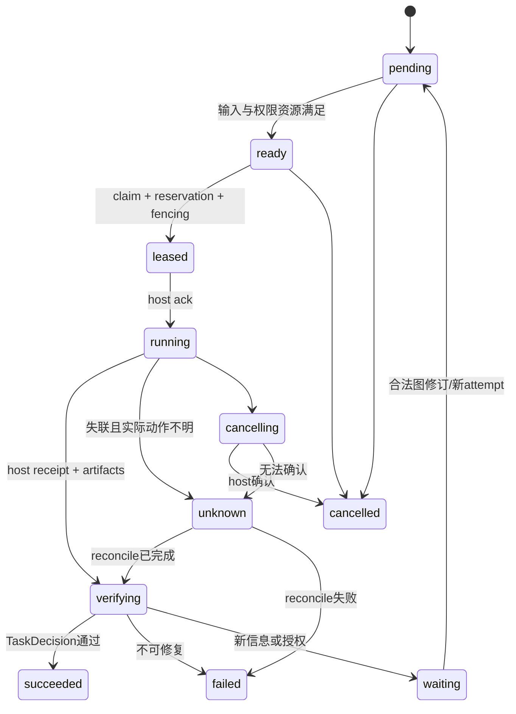

# 公共协议与关键状态合同草案

状态：提案，待 L1 双宿主探针与人审定案；以下是设计规格，不是已存在的 API。

## 1. 公共对象

| 对象 | 最少字段与语义 |
|---|---|
| TaskContract | taskId、version、goal、requiredOutcomes、acceptance、workspace/artifact scope、authority grant、budget、privacy、termination |
| GraphSpec | graphId、revision、taskContractRef、nodes、typedEdges、requiredJoins、resourcePolicy、graphLimits |
| NodeSpec | nodeId、kind、inputRefs、outputSchemas、loop/subgraph spec、contextPlan、tool/model requirements、read/write resources、termination |
| GraphPatch | expectedRevision、adds/changes/removals、reason、authorityRef；与正在执行的 input 变更冲突时拒绝 |
| HostManifest | host/vendor/version、协议版本、verified能力与证据、partial/absent/unknown、usage sources、cancel/recovery/isolation 强度 |
| Command | commandId、sessionId、expectedRevision、actor/grant、typed payload |
| Event | eventId、sequence、sessionId、revision、epoch、causedBy、type、typed payload、visibility |
| Effect | effectId、idempotencyKey、epoch、nodeId/attemptId、authorityRef、reservationRef、inputRefs、deadline、kind/payload |
| Receipt | effectId、hostInvocationId、epoch、status、actual outcome、artifactRefs、usage、observability、error |
| ArtifactRef | id、content digest、producer identity、graph/node/attempt/base binding、schema/version、location、visibility与expiry |
| DecisionRecord | decisionId、kind、inputs bindings、contract/evaluator versions、outcome、reasons、evidenceRefs、feedbackVisibility |
| CapabilityAsset | assetId/revision、kind、scope、contentRefs、sourceTraces、dependencies、hypothesis、qualification、evaluationRef、expiry/revocation |
| ActivationReceipt | asset revision、host/session/scope、previousSnapshot、新快照、actual status、authorization/evaluation bindings |

GraphSpec 可序列化且与 SP 文件格式独立。品牌能力不硬编码进协议；host/version只是身份和资格条件。

## 2. 最小应用服务轮廓

```ts
// 提案示意；名称、签名与发布路径在 l1_api_freeze 定案。
createSession(taskContract, hostManifest, stores): SessionHandle
handleCommand(command): Promise<CommandResult>
ingestHostEvent(hostEvent): Promise<IngestResult>
receiveEffectReceipt(receipt): Promise<ReceiptResult>
readSession(sessionId): SessionView
nextEffects(sessionId): readonly AuthorizedEffect[]
pauseSession(command): Promise<PauseResult>
resumeSession(command): Promise<ResumeResult>
cancelSession(command): Promise<CancelResult>
reconcileEffect(command): Promise<ReconcileResult>
evaluateTask(request): Promise<TaskDecision>
evaluateCandidate(request): Promise<CandidateDecision>
promoteAsset(request): Promise<PromotionResult>
activateAsset(request): Promise<ActivationResult>
revokeAsset(request): Promise<RevocationResult>
```

依赖注入 ports：HostPort、EventStore、ArtifactStore、WorkspacePort、EvaluatorPort、Clock、Policy/Budget、AssetRegistry。core import不查 cwd、不发现凭据、不打开 native DB、不启动模型/CLI。

持久副作用入口全部校验 expected revision 与 idempotency identity；view/query入口读取派生投影。View 不提供绕过状态机的写权限。

## 3. 两宿主所需语义矩阵

| 语义 | DSH 文档/实现起点 | Pi 文档/实现起点 | 必须证明什么 |
|---|---|---|---|
| 任务/会话 identity | Agent/session 与 projection API | session manager + extension lifecycle | 启动、切换、fork、恢复不串错会话 |
| 节点前上下文 | agent/pre-step | before_agent_start/context 等版本接口 | 在安全点可注入有限 packet，保留用户 instructions |
| 工具前策略 | tools/pre-execute | tool_call | 覆盖范围、拒绝优先级、错误行为；无 OS 保证推断 |
| 实际工具结果 | tools/result | tool_result / execution events | 原调用身份、结果、异常、产物与实际信号 |
| 多 agent | agentTeams/workflow/child API | 适配层使用 SDK child session | caller authority、grant继承、lifetime、bounded delegation |
| usage | adapter/runtime 原始来源待 probe | message/session usage来源待 probe | 覆盖父/子/学习/验证调用，避免重复累计 |
| 真正 idle | runtime/task终态待 probe | agent_end与settled版本差异 | 后续 retry/compaction/continuation完成前不早激活 |
| 持久/恢复 | session projections +独立 runtime journal | appendEntry/session state +独立 runtime journal | 宿主状态与 journal核对，旧 epoch隔离 |
| 取消 | Agent cancel/team interrupt 等待 probe | abort/child signal 等待 probe | 取消已执行、未执行与 unknown 的区别 |

这些是研究输入，矩阵目前均未经过我们目标版本的 runtime conformance。文档中有接口不等于本次实现有能力。见 [SOURCES.md](SOURCES.md)。

## 4. 节点、attempt 与 session 状态

产品建议节点路径：



`failed` 不原地改成“之前没发生”；retry产生新 attempt并绑定前次证据。`succeeded` 对应明确 contract revision，图修改后不默认满足新要求。暂停 session 不等于所有 child已经停止。

图变更的原子验证至少包含：schema/版本、引用、依赖投影环、数据产物可消费性、required fan-in、作用域授权、资源 conflict、attempt/loop/depth/budget边界以及 reachable终止条件。

## 5. 并发、writer 与恢复不变量

1. 同一节点同一 attempt最多有一个有效 claim；同一排他资源最多有一个有效 lease。
2. leases带 fencing/epoch，过期 owner不能提交产物或能力指针。
3. parent/child共享预算总账；请求先预留，receipt后结算，取消后释放已证实未花费的部分。
4. journal与outbox在相同 CAS revision原子提交；dispatch只消费已提交 intention。
5. host请求与receipt可重复送达，业务归约/usage只应用一次。
6. 不能保证外部动作 exactly-once；unknown效果必须reconcile，非幂等动作不可盲重试。
7. integration writer和asset pointer writer串行提交；workspace实际写入失败不由DB成功掩盖。
8. fan-in消费明确的分支清单，缺失/取消/失败必需分支不会被过滤。
9. schema/epoch/sequence缺口不能用缓存投影假装恢复成功。
10. replay不会调用模型、工具或文件写入；它只重建状态与待核实列表。

共享 host task board的角色必须在 adapter中固定：它可作为执行投影，或者显式被委托为某子图执行 authority；两边不得各自独立认为自己拥有同一 claim。

## 6. 四类判定与错误

| 判定 | 可以返回 | 必须绑定 |
|---|---|---|
| TaskDecision | completed、repair、failed、needs-human、unknown | task contract、必须分支、实际产物和证据 |
| CandidateDecision | validated、rejected、inconclusive | candidate内容、base、版本、数据协议、usage与不变项 |
| PromotionDecision | promoted、denied、needs-human | evaluation receipt、scope、grant、policy version |
| ActivationDecision | active、failed、unknown | host实际回执、新旧snapshot、asset version和授权 |

候选作者的完成声明不能作为验证器的充分证据。长期收益可以多指标；普通 task completed无需相对 baseline改善。

错误族建议：schema/version、revision/conflict、unsupported能力、authority、budget/usage缺失、artifact/binding、host/cancel、recovery/unknown、evaluation/insufficient、asset/scope/revoked。具体code表在L1定案；SDK传typed结果，CLI/host显示同一错误，不各自推断第二套code。

## 7. 验证、晋升与资格

资产状态提案：`staged → validated → promoted → active`，并支持 `rejected/inconclusive/expired/revoked`。`active` 应记录在具体host/session/scope的activation snapshot；一个资产可能在DSH已active而Pi尚未激活，不能用单全局bool表示。

资格不变量：

- EvaluationReceipt绑定完整candidate digest、依赖revision、协议、host/model条件与数据拆分。
- 所有必需评价通过，且预授权规则允许，才可promote。
- 实际host activation失败保留旧snapshot；partial或unknown进入reconcile。
- 相同候选不能换一个摘要外的内容偷用已验证资格。
- 失效来源或被撤销依赖使派生资格失效，后续检索停止使用。
- 新候选生成在授权的项目asset staging区；已有全局Skills只读。
- 终审评价结果只作最终验收，不作为继续优化候选的反馈。

## 8. 评测合同草案

protocol至少冻结：task corpus版本与拆分；DSH/Pi版本；model/provider/version；tools与权限；budget分类、预留和完整性规则；A/B/C配置与学习资产freeze；随机种子/顺序；主指标、成本时间约束；最小有价值收益；样本量/区间/停止方法；超时、失败、usage缺失和排除规则；终审权限。

候选开发与评测分账且总成本一并报告。固定每组同样预算上限并报告实际花费；如果无法资源匹配，明确实验限制，不宣称因果收益。DSH/Pi分别评价，再给总体结果，不能以一边收益抵销另一边不实用。

具体阈值、样本量与模型预算尚未决定，不存在本轮已运行试验。本轮图设计完成只能证明规划可审阅。

## 9. breaking与资料保留

新格式使用独立标识，例如 `evofence.runtime/1`，具体名称待定。旧ledger v2和旧YAML version不被复用来暗示兼容。

旧bundle可显式导入为`legacy source`，保留原摘要、格式与出处；它没有新版执行恢复资格，也不能自动激活资产。导入过程可撤销并不写原件。旧graph与ADR只读参考，不手改旧导出视图。
