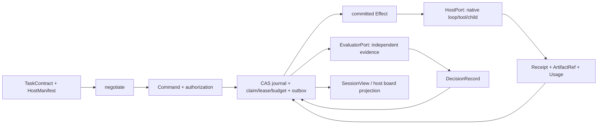

# 版本化接口合同（Versioned Interface Contract）

状态：**冻结提案 `l1-freeze.2`，供 `l1_replan` 真人定案**。冻结表示本轮提案内部语义固定，不表示人审批准、API 已发布或实现符合合同；管辖 ADR 0001/0004/0006/0009/0010 仍为 proposed。

## 1. 版本、兼容与旧资料

| 项 | 本轮确切选择 | 语义 |
|---|---|---|
| Runtime namespace | `evofence.runtime/1` | 新会话、图、命令、事件、效果、回执与裁决 |
| Asset namespace | `evofence.assets/1` | 资产内容、引用与资格；不借旧资产的执行资格 |
| schemaVersion | `1.1.0` | namespace 内确切 codec；不使用范围、latest 或隐式默认。本版由 `1.0.0` 递增（新增必填字段，理由见下） |
| schema bundle ID | `urn:evofence:runtime:1.1.0` | [SCHEMAS.md](SCHEMAS.md) 的 JSON Schema 2020-12 |
| 文档冻结版本 | `l1-freeze.2` | 人审前文档提案身份，独立于 npm 产品版本 |

对象额外字段拒绝，兼容集合使用 `HostManifest.compatibleProtocols` 的精确版本对。旧 codec 不自动接受新 minor。minor 可以增加可选字段、能力键或错误码，但须生成新的 schemaVersion、显式协商并保持旧 codec 可单独读取；不得在既有版本原位扩大枚举。patch 只修不改变合法输入、判定或含义的说明/实现缺陷。删除/改名、必填字段、状态转移、权限/预算/幂等/错误重试含义、裁决所有权或既有字段语义变化，进入下一个 major namespace（如 `evofence.runtime/2`），资产 breaking 同理进入 assets/2。

**本版变更（`1.0.0` → `1.1.0`，`l1-freeze.1` → `l1-freeze.2`）**：`SessionView` 增必填 `nodeStates`（唯一读面原先无法表达 CONTRACTS §4 状态机）；`DecisionRecord` 增 `taskEvidenceRef`/`evaluationReceiptRef`/`activationReceiptRef` 并按 `kind` 约束非 null，`contractRef` 收窄为仅 `task` 非 null；`CapabilityJudgement` 增三个护栏字段。逐条见 SCHEMAS 的「变更记录」。

**为何按 minor 而非 major（必读前提）**：本变更含**新增必填字段**，按上一段本应升 `evofence.runtime/2`。按 minor 处理的条件是 **`1.0.0` 从未被任何实现、宿主或持久投影消费**（本节状态为待 `l1_replan` 的提案）。一旦出现 1.0.0 消费方，本项必须改按 major 升 `/2`。

**版本判定的机检反例（该规则必须可失败）**：给定旧/新两份 codec 文档做逐字段 diff，若出现「删除或改名既存字段、使可选字段变必填、收窄既有 enum、变更既有字段语义」而 namespace 未升 major，则拒绝并报 `EFK_PROTOCOL_UNSUPPORTED`。反例：删掉 `SessionView.dispatchMode` 而只把 `schemaVersion` 从 `1.1.0` 改为 `1.2.0`，必须失败。该 diff 器属 L2 guard，本节点只冻结判据。

`TaskContract.version`、graph revision、journal revision、attemptOrdinal、epoch、fencingToken 均非 schemaVersion。不同计数不相互替用。旧 ledger v2/YAML v1/bundle 可保留为带原摘要和出处的 legacy source；新版入口拒绝直接执行、恢复和激活（EFK_LEGACY_NOT_EXECUTABLE）。本节点不提供自动迁移，不修改原件，参见 proposed adr_0010。

## 2. 公共对象与数据流

字段的唯一规范在 SCHEMAS；直接成员共 427 个，423 个必填，可空字段也必须出现。表中的引用均校验实际字节摘要和完整 binding。

| 对象 | 责任与禁止越界 |
|---|---|
| TaskContract | 绝对任务目标、产物、验收、必须分支、权限、预算、隐私、终止和能力要求；不是能力收益实验 |
| GraphSpec / NodeSpec / GraphPatch | 7 类节点、6 类边、版本化图与原子 patch；resource 为节点声明/图策略 |
| Command / CommandResult | 所有持久变更的幂等+CAS封套与结果；调用成功不等于任务成功 |
| Event / SessionView | journal 真相与只读派生状态（`nodeStates` + `dispatchMode`）；host 序号不当 journal 序号 |
| Effect / Receipt / Usage | 已提交意图、实际执行回执与来源计量；回执不自行授予 succeeded |
| HostManifest / NegotiationResult | 版本/范围/证据驱动的准入；raw 探针 manifest 尚无新版执行资格 |
| ArtifactRef | 内容工件：摘要、producer、binding、schema、可见性、拆分和失效期；node/effect产物必须绑定，事先源/批准/协议快照允许null并由消费命令绑定；不是资产资格 |
| DecisionRecord | 四类裁决的封闭 kind/outcome 与 **kind 专属充分输入引用**（task→`taskEvidenceRef`；candidate/promotion→`evaluationReceiptRef`；activation→`activationReceiptRef`）；不能互相代替 |
| CapabilityAsset / AssetRef / EvaluationReceipt | 完整内容、依赖、评价条件和资格引用；AssetRef 引用不等于已激活 |
| ActivationReceipt | 具体 host/session/scope 的新旧快照和实际激活结果；active 不是全局 bool |
| TaskEvidenceReport / BranchEvidence / JoinReceipt | evaluator/汇合输入，缺失、失败、取消分支显式保留 |



EventStore 是唯一事件真相源（Event Source of Truth）；host transcript、board、自定义 entry、CLI/图工具都只能是输入或投影。持久性是注入 backend 的能力，不是内存模式或 Pi JSONL 的推论。

## 3. 服务签名与注入端口

下列是未来导出 `evofence/core` 的签名合同；当前仓库没有由本节点实现或发布该入口。类型取 SCHEMAS 的同名定义，`Id` 为该 schema 的字符串，`AuthorizedEffect` 是已提交且再次获准的 Effect 的只读视图，**不是另一种线格式**。接口通过 factory 注入 ports，不发现安装、凭据、cwd、数据库或模型。

```ts
createKernel(ports: Ports): KernelService; // 构造对象，不做外部 I/O

interface KernelService {
  handleCommand(command: Command): Promise<CommandResult>;
  createSession(command: Command): Promise<CommandResult>;
  ingestHostEvent(command: Command): Promise<CommandResult>;
  receiveEffectReceipt(command: Command): Promise<CommandResult>;
  dispatchEffect(command: Command): Promise<CommandResult>;
  readSession(sessionId: Id): Promise<SessionView>;
  nextEffects(sessionId: Id): Promise<readonly Effect[]>;
  pauseSession(command: Command): Promise<CommandResult>;
  resumeSession(command: Command): Promise<CommandResult>;
  cancelSession(command: Command): Promise<CommandResult>;
  reconcileEffect(command: Command): Promise<CommandResult>;
  evaluateTask(command: Command): Promise<CommandResult>;
  evaluateCandidate(command: Command): Promise<CommandResult>;
  promoteAsset(command: Command): Promise<CommandResult>;
  activateAsset(command: Command): Promise<CommandResult>;
  revokeAsset(command: Command): Promise<CommandResult>;
}
negotiate(task: TaskContract, manifest: HostManifest): NegotiationResult;
```

服务 wrapper 只核对对应 kind 后进入同一个 handleCommand；没有旁路写接口。createSession 使用 session.create，图修改/claim 直接 handleCommand。`ingestHostEvent` 对应 host.observe，objectRef 为绑定、摘要、schema 已核验的宿主观察工件；`receiveEffectReceipt` 对应 effect.receipt，objectRef 的内容必须解码为 Receipt。两者保留实际 call/session 身份并核对来源，不能把任意宿主回调当有效内核命令。决策结果从 CommandResult.decisionRef 读取 DecisionRecord；不会返回无 CAS 的第二套裁决。

> **与 CONTRACTS.md §2 的差异（刻意合并，非遗漏）**：§2 的 per-op 返回类型（`IngestResult`/`ReceiptResult`/`PauseResult`/`ResumeResult`/`CancelResult`/`ReconcileResult`/`TaskDecision`/`CandidateDecision`）统一并入 `CommandResult`（裁决经 `CommandResult.decisionRef` 读取），`SessionHandle` 由 `SessionView` 取代；新增 `dispatchEffect`（§2 无）。

| CommandPayload.kind | 非 null 字段（其它可空字段必须 null） |
|---|---|
| `session.create` | `task`, `graph`, `manifestRef` |
| `graph.patch` | `patch` |
| `node.claim` | `binding` |
| `session.pause` | `reason` |
| `session.resume` | `manifestRef` |
| `session.cancel` | `reason` |
| `effect.reconcile` | `objectRef` |
| `task.evaluate` | `binding`, `objectRef` |
| `candidate.evaluate` | `objectRef` |
| `asset.promote` | `objectRef` |
| `asset.activate` | `objectRef` |
| `asset.revoke` | `objectRef`, `reason` |
| `host.observe` | `objectRef` |
| `effect.receipt` | `objectRef` |
| `effect.dispatch` | `objectRef` |

所有变更检查 actor/grantRef/sessionId/expectedRevision/commandId。相同 ID 同摘要返回原结果 duplicate，不再次归约；不同摘要拒绝。新 session 的 expectedRevision=0。每个成功事务 revision 加一；其事件 sequence 连续，自 0 开始，同一事务可有多个事件。GraphPatch.expectedRevision 另指 graph revision，并与当前图匹配。schema 或授权失败不改状态、不产生 outbox。graph/node额外tool/model要求在图接受与node.claim再协商，其授权/budget须在task ceiling内；未声明/未准入的强保证不能从空task要求旁路派发。

readSession/nextEffects 无状态写权限。nextEffects 不表示已经执行，不产生“已完成”结果；派发器核 epoch、lease、权限撤销、预算和 deadline 后才调用 HostPort，dispatchEffect 对应 effect.dispatch，objectRef必须引用该session已提交Effect；当前CAS记录effect.dispatched并核一次有效dispatch claim后才调用HostPort。重复命令不二次调用；commit后执行前崩溃或调用结果不明进入unknown/reconcile，不凭派发标记重执行。实际执行回执另走effect.receipt；commit本身不证明已完成。只读查询也经注入只读策略过滤私有证据。

| 注入 port（Dependency Injection Port） | 冻结责任 / 可接受类型 | 禁止承担 |
|---|---|---|
| HostPort | execute(Effect) → Promise<Receipt>；原生 agent/tool/delegate/cancel/activate/reconcile；返回真实观察和工件引用 | 创建权限根、TaskDecision、自行重派 unknown |
| EventStore | append(expectedRevision, Event[], Effect[]) 原子 CAS；read/replay/outbox；同事务管理 claim、lease、预算 reservation、去重索引 | 调模型、执行效果、独立验收、另造第二份 truth |
| ArtifactStore | 读取/保存不可变工件字节，ArtifactRef+schema/digest验证；secret拒绝 | 以文件存在授予资格，覆盖旧工件 |
| WorkspacePort | 当前授权范围内实际 read/diff/write与工作区证据；integration/asset writer串行 | DB 成功冒充写盘成功、把 worktree 叫 OS sandbox |
| EvaluatorPort | evaluateTask(TaskContract, TaskEvidenceReport) → DecisionRecord；evaluateCapability 的完整评价 → EvaluationReceipt | 用作者自述替代运行证据，向作者泄露私有/终审 |
| Clock | now() → Instant；计时/等待由注入实现执行，纯 reducer 只接收确定时间输入 | 导入时读取时间，重放期间启动定时器 |
| PolicyPort | actor/grant/root授权、降级/晋升政策的只读验证；完整引用与版本绑定 | 内核自行扩权/读取凭据；批准把 unknown 改 verified |
| BudgetPort | 确定性预留/结算计划，request 身份与价格快照核对；提交只由 EventStore | 独立持久预算真相、缺 usage 补零 |
| AssetRegistry | project staging/依赖/资格/检索快照；事实变更进入相同命令和 journal | 全局 active 标志、自主晋升、覆盖已有全局 Skills |
| DigestPort | 按明确字节与确定规范产生 Digest，注入纯实现；core 不依赖 node:crypto | 根据环境猜摘要、把文件路径当内容 |

Ports 是进程内接口集合，不序列化对象、回调或凭据；schema 只定义跨边界数据。EventStore.append 的“原子”含其事务内全部 claim/lease/reservation/outbox 变化，不允许分散在外部 BudgetPort 数据库。所列行为为 L2 必须实现的合同，不是当前探针已验证保证。

core 无强制依赖（`adr_0009`）的**机检规则在 [OWNERSHIP.md](OWNERSHIP.md) I01–I08**（import/export 闭包、拒绝全部 bare specifier 与 node builtin），本节只声明注入式接口形态；本轮 guard 未实现。

## 4. 状态、图与并发冻结

状态固定 pending/ready/leased/running/verifying/succeeded/failed/waiting/unknown/cancelling/cancelled。执行顺序、A1–A6/B1–B3/INV 与 11 项校验严格引用 [SEMANTICS.md](../graph/SEMANTICS.md) §2–§5 和 [EXAMPLES.md](../graph/EXAMPLES.md)，不改变其优先级。

| 边界 | 必须行为 |
|---|---|
| claim/lease | 同 node+attempt 最多一个有效 claim；排他资源最多一个 holder；epoch+fencing 阻止旧 writer |
| 正常执行 | pending→ready→leased→running→verifying；仅绑定的 TaskDecision 可使 verifying→succeeded/failed/waiting |
| 读面 | `SessionView` 是 journal 的派生投影：`nodeStates` 给出每 attempt 的当前状态与 `sinceSequence`；不是第二真相源，也不授予写权限 |
| repair/fallback | 原失败及证据保留；repair 新 attempt；fallback 原节点仍 failed；不是原地洗掉失败 |
| 路由/终点 | A1 terminal 优先，A2 匹配 route，A3 repair，A4 fallback，A5 未匹配路由失败，A6 无 real consumer 的非 terminal 触发 INV |
| 汇合 | B1 未完成且有合法 cover 优先 waiting；B2 放弃且无 cover failed；B3 尚待输入 waiting；只消费明确 requiredBranches，不删失败 |
| graph patch | 11 项原子校验一起通过才提交；dependency∪data 无环；leased/running/verifying/unknown/cancelling 不原地改 binding |
| data未来产物 | 建图可artifact=null、expect显式匹配producer唯一outputSchemas槽；此时consumer不ready；真实receipt后精确绑定digest/attempt，不猜依赖、不取latest；见SCHEMAS §3 |
| bounded loop | 4 类界至少 2 类；body/stop/carry 显式；父池/剩余界不因新 attempt/loop/fallback 重置 |
| 谓词 AST | eq/neq: 非空路径、JSON标量（string/boolean/safe integer/null）值、零 children；all/any: 至少 1 child、path/value=null；not: 1 child；true: 零 child；不执行脚本 |
| 谓词路径 | 仅读取该次绑定 outcome/reason 与合同声明的 immutable env；不能读取 host 品牌、凭据或未验证工件 |

Predicate.value按原始类型精确比较，不做JS coercion；unknown/missing路径不匹配，不能用null把missing判成功。route/repair/fallback的源码式示例在构建GraphSpec时显式编译为纯AST，不能在运行时执行env.hasTool等代码字符串。env.<key>仅可读取NodeSpec.inputRefs中已绑定、摘要/schema核验的immutable environment工件；key必须在该工件schema声明，未提供工件/路径为unknown而非true。不能从进程环境或凭空的TaskContract.env读取。资源写路径由 Scope 和 Resources 指向注入 resolver，路径归一化/符号链接核验不能只比较字符串前缀。

## 5. 取消、暂停、恢复、预算

| 操作 | 状态与确认 |
|---|---|
| pauseSession | dispatchMode=paused并停止新派发，epoch不变；已有子任务逐一登记，pause 不声称它们已停止 |
| cancelSession | 未执行项证实未派发可 cancelled；已派发转 cancelling；native ack +相关 lease释放才 cancelled；无法确认→unknown |
| resumeSession | dispatchMode恢复active前校验精确manifest、schema、journal sequence/epoch和host session，resume/恢复递增epoch；恢复投影先核实际动作，unknown 不自动重做 |
| reconcileEffect | 幂等地核实实际结果；完整证据→verifying/failed，不足→unknown；已证实未执行的非幂等动作必须新授权/新意图，不复用盲重试 |
| replay | 仅从 journal 重建状态/outbox/待核实列表；模型、工具、workspace 写入次数必须 0 |
| stale receipt | epoch/attempt/base/fencing不匹配仅 receipt.archived；保留证据，不写当前产物/资格、不再次结算 |

每个真实或隐式模型调用（父/子/学习/验证/重试/压缩/continuation）都属于同父预算池，先 reservation 后派发。requestId 同摘要只结算一次；原始 usage、归一化 usage、估价/账单区分保存。cached 与 uncached input 分账，reasoning 已包含在 output 时不重复相加。DSH synthetic、Pi 实际 provider usage 与参考价，不能跨 source 当 invoice（[HOST-MAPPING](HOST-MAPPING.md) D5/P5/D21/P21）。

费用使用整数微美元（USD micros），每请求最坏费用向上取整；settled+outstanding≤cap。失败、abort、失联后缺 usage 保留预留，不能补 0 或根据 SDK 的本地 abort 零值认定供应商免费。预算类别分别为 development/probe/controlled-experiment/judging；某类授权不能挪给另一类。maxUsdMicros=null 仅明确无上限的授权类别可用，不能表示缺额度时放行。授权引用或需求界缺失拒绝 EFK_BUDGET_NOT_AUTHORIZED；需要USD上限/比较时缺冻结价格同样拒绝。明确授权无USD上限的development仍按request/token/wall计量，缺价格将USD记unknown，不补零、不宣称成本可比。

受控试验 envelope 的精确预留与上游金额取整矛盾见 OPEN-ITEMS H11，自 `1.0.0` 起选择整数校验、拒绝不自洽包络。人审等待单列，不计 active wall；暂停本身并非 human wait，不能成为无限资源占用或免计时入口。所有 wait 仍受显式终止/租约政策约束。

## 6. 四类裁决与学习资产

| DecisionRecord.kind（类型别名） | outcome | 唯一充分输入 / 边界 |
|---|---|---|
| task（TaskDecision） | completed / repair / failed / needs-human / unknown | 精确合同、必须分支、真实 artifact/diff/运行证据；绝对验收，不需相对收益。**`contractRef` 与 `taskEvidenceRef` 必须非 null** |
| candidate（CandidateDecision） | validated / rejected / inconclusive | 完整 candidate/base/dependencies/host/model/数据协议/usage；收益评价和静态资格均不能跳过。**`evaluationReceiptRef` 与 `capabilityJudgement` 必须非 null** |
| promotion（PromotionDecision） | promoted / denied / needs-human | 完整 EvaluationReceipt、scope、grant、版本政策；validated 不自动 promoted。**`evaluationReceiptRef` 必须非 null** |
| activation（ActivationDecision） | active / failed / unknown | safe idle、grant、lease、完整资格及实际新旧 snapshot；promoted 不自动 active。**`activationReceiptRef` 必须非 null** |

类型别名都是 DecisionRecord 的 kind 限定，不增第二套 schema；但四类的充分输入现在是**字段级**约束（`allOf` 按 kind 要求对应引用非 null，S16），不只是枚举级区分。TaskEvidenceReport 的未知必需验收项返回 unknown；已证实验收失败返回 failed/合同允许的 repair。实验 ITT 将 incomplete/timeout/cancelled/usage_incomplete/needs-human计 task_success=0，不能倒写所有这些生产节点为 failed；任务产品状态与实验判定分开。

evaluateCapability 采用 evaluation/METRICS v3 §5.2 的唯一有序函数：L0 capability_absent/not-yet-comparable→blocked；L1 usage incomplete ratio>0.05 或污染/泄露→inconclusive；L2 futility 只可 inconclusive/continue，非确认看→exploratory_only；L3 确认看 n≥planned 且 discordance≥25，才按 Z_MVE≥1.960 / ≤−1.960 给 positive / negative，其余 inconclusive。continue 是内部控制流，**不是** verdict 枚举。BCa CI 只报告/敏感性，不覆盖 Z_MVE；质量分及其一致性不覆盖 task_success。两个宿主各自评价；固定顺序 B−A positive 才开启 C−B，不能一侧抵消另一侧。

METRICS §5.1 的成本/时间/截断护栏仍是产品/晋升条件，不能被 §5.2 的统计 positive 代替。保留 CapabilityJudgement 的统计结果，同时在 EvaluationReceipt.requiredJudgements/evidenceRefs 和 PromotionDecision.reasons 记录护栏结果；统计 positive 但护栏失败，不得 promoted 或宣称重构目标达成。无需改写唯一统计函数。T0 未签署不生成确认性评价资格。

资产原件保留，候选只写授权的 project staging；已有全局 Skills 只读。controlled-experiment 资产 sourceTraces 仅 train，dev 仅评价/选型，held-out/final 不回流；上游 train/dev 措辞矛盾留 H10。资格失效、依赖撤销/过期停止检索；激活实际失败保留 previousSnapshot，unknown 不指向假 newSnapshot。host idle 是必要前置，不能代替激活回执。

## 7. 能力协商算法（Capability Negotiation）

输入必须为经证据校验的规范 TaskContract/HostManifest，输出 NegotiationResult。纯函数不读网络/磁盘/时间、不安装依赖；证据真实性与当前版本核验在准入 snapshot 制作阶段完成，冻结其 hash。规则不使用 identity.host/vendor 选择准入，identity只用于绑定匹配。

定义 `satisfies(r,m)`：
1. 存在 r.capability；缺键按 unknown，不用对端或通用文档补齐。
2. status=verified；partial 的 verifiedSubset 只能为**单独、已证实的替代语义能力键**供证，不能直接满足原 hard；替代仍要求自身status=verified。同一个partial键不会因列入alternative就获准。
3. scope.hostVersion 与准入固定安装版本一致；有 provider-live 要求时 provider/model/payload 与任务条件一致。
4. r.coverage 全部被 scope.coverage 的同语义标签覆盖；无隐含“包含全部”。
5. r.evidenceKinds 每一种均有 hash+pointer+claim 匹配、覆盖该 requirement 的证据。种类是集合，不以“live更强”替代 disk/fault-injection。
6. isolation/cancel/recovery 的 requirement 一样走语义键与范围，不特殊放行品牌。

```text
validate task/manifest schema + compatibleProtocols + pin snapshot
original := requirements sorted by capability (no duplicate capability)
for each r in original:
  if satisfies(r, manifest): add r.capability to satisfied; continue
  record gap with raw status, reason, evidence and allowed alternativeIds
  if r.mode == hard: unsupported := true; continue
  candidates := task.degradations named by r.alternativeIds
  for a in candidates sorted by alternativeId:
    require a.replacesCapability == r.capability
    require every a.requirement is hard and satisfies(manifest)
    require no cycle/recursive alternative and nonempty exact tradeoff
    if technically met and valid human approvalRef bound to taskDigest,
       manifestDigest, a and trust/budget/scope:
         choose first approved candidate; preserve original gap
    else if technically met: remember pending-approval
  if none technically met: unsupported := true
if unsupported: status=unsupported
else if any unmet original has no approved candidate: status=needs-degradation
else: status=executable
```

approval 校验输入由 PolicyPort 预先确定并以 ArtifactRef 绑定；纯协商不验账号或读取秘密。批准只更换任务允许的 guarantee/tradeoff，不提升原 capability 状态；需要新保证的替代若尚无证据仍 unsupported。多缺口之间不能相互借未成立能力充当证明。已批准替代保留 gaps/selectedAlternatives/approvalRefs；无批准的 needs-degradation **不得派发**。审批项对应 OPEN-ITEMS ID，但人审清单条目本身不是 approvalRef。

| 示例输入 | 当前证据 | 算法结果 |
|---|---|---|
| hard provider-live usage、同供应商模型 | D5 verified仅fixture / P5 verified真实两请求 | DSH unsupported；Pi只在P5模型/请求范围可满足，不宣称全生命周期 coverage |
| hard server-tier high | D14 unknown / P14 partial | 两侧unsupported；请求参数 high 可接受不成立独立档位 |
| hard acknowledged-durable message | D10 unknown且false；Pi该键缺失 | 两侧unsupported；共享journal+ack替代待L2取证和H05批准 |
| hard disk transcript reopen | D7 memory / P7 native-disk | DSH unsupported；Pi指定reopen范围成立，不推出effect crash恢复 |
| hard OS sandbox | D15 unknown / P15 absent | 两侧unsupported；same-user降级需任务明确degradable与H06批准 |
| 无team要求，有限单agent任务 | D1–D3/P1–P3指定范围 | 不因host缺原生board拒绝；其它journal/grant/预算要求仍须独立成立 |

必须的协商一致性用例：交换 host/vendor 标签不改变结果；unknown→partial不绕 hard；缺证据种类拒绝；降级批准不提升status；精确pin漂移拒绝；coverage新增与其证据须一致。这是L2合同用例清单，当前没有可运行实现的通过声明。

## 8. 冻结不变量与证据限度

唯一裁决、单一 journal、宿主执行与权限根的形式判据见 [OWNERSHIP.md](OWNERSHIP.md)。十条 CONTRACTS §5 不变量、SCHEMAS S01–S24 和该判据共同构成 conformance suite；两个宿主用同一套语义断言，差异仅由 HostManifest/证据范围解释，不写品牌白名单。

本轮只完成协议文档、字段引用和证据自洽性检查；没有执行 reducer、atomic outbox、生产权限、崩溃恢复或真实资产激活。DSH零付费且历史drift日志缺失、Pi high partial、DSH message false及OS unknown均保留，下一阶段不得用本文件替代待取证项。
