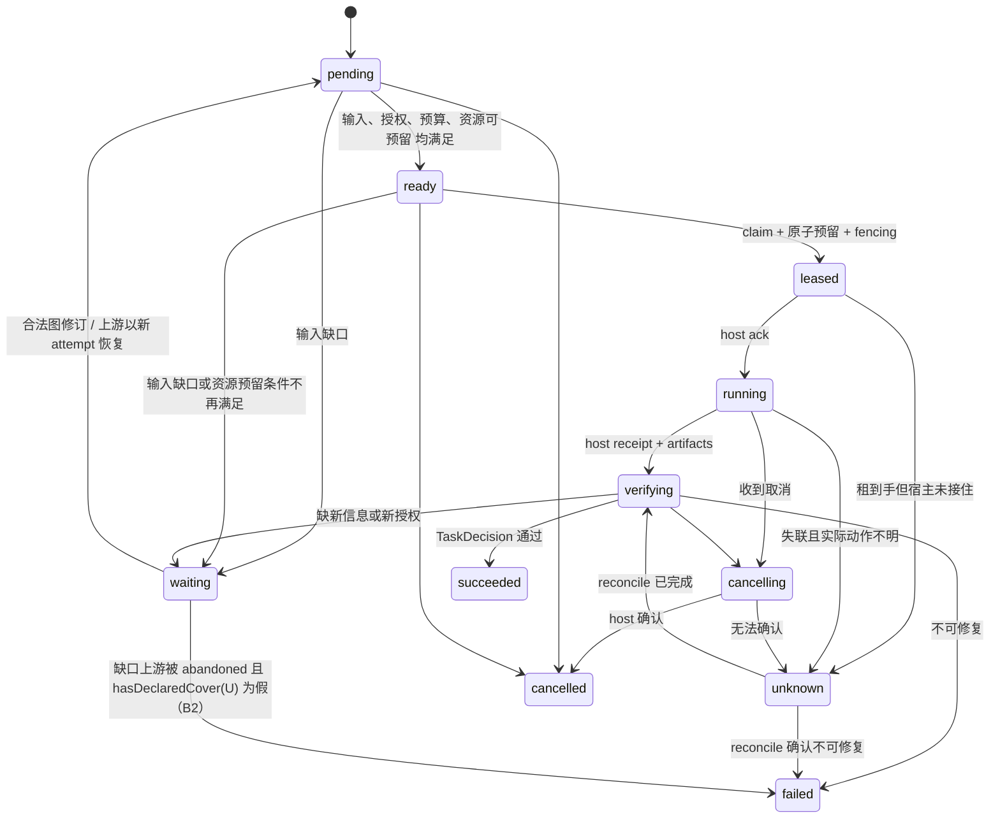

# 图执行语义（Graph Execution Semantics）

节点：`l1_graph_contract`（L1）· 管辖 ADR：`adr_0002`（动态 Graph Engineering 与有界 agent loops）
状态：**L1 研究产物，待 `l1_replan` 人审**。本文拟冻结**语义**，不冻结 TypeScript 签名（签名在 `l1_api_freeze`）。

术语对照：GraphSpec / NodeSpec / typed edge 与 [CONTRACTS.md](../CONTRACTS.md) §1 一致。
本轮的 super-plumber 实施图（`.graph/evofence-harness-kernel/`）是**设计工具**，不是产品运行图；两者语义不同，见 §7。

> **修订记录**
> - **rev6（本版）**：修掉第五轮复核的 1 BLOCKER（**谓词覆盖缺口**）。rev5 把 `declaredOutgoing` 限定为 routing 出边，使**只带 blocking 出边的普通生产节点**被 §5.1 第 10 项错误拒绝并落入告警。rev6 拆出 `hasRoutingOutgoing` / `hasBlockingConsumer` / `hasRealConsumer`，新增规则 **A6**（blocking 消费者是 outcome 的合法消费者）；F 编号改为 **`A1–A6` / `B1–B3` + `INV`** 两套前缀，§3.1 与 §5.3 的引用同步。
> - rev5：`repair` 边补入判定函数（新增 `hasMatchingRepair`）。
> - rev4：单向对齐——规则编号 → 五维单元格 → 校验清单 → fan-in 判定 共用同一套可观测谓词；新增 §2.4 定义 `terminal` 与 `abandonedBranches` 载体；R4/R5 补入 §5.1（第 10/11 项）；`decide()` 拆为 `{ nodeState, graphActions }`。
> - rev3：§3.0 由口号改判定函数；`unknown ≠ waiting`；§2.2 图表对齐。
> - rev2：`fallback` 保留原失败；`resource`/`join` 移出边类型；状态机补 `waiting` 入边；选型降为「建议采用（待审）」。

---

## 1. 为什么要先定语义再选库

`adr_0002` 选定"任务驱动动态图 + 验证模板"。要让它可恢复、可审计、可恢复计费，必须先回答：**每条边在五件事上分别意味着什么**——ready、取消、失败、恢复、预算。现成图库与 agent 框架对这五件事各说各话；先把语义定死，选型才有判据（§6）。

设计基线（[ARCHITECTURE.md](../ARCHITECTURE.md) §6 与 `adr_0002`）：

- 节点是**执行单元**，不是模型调用；一个 agent 节点内部可包含完整的有界 loop。
- **依赖投影无环**（拓扑必须可排序），**控制路由允许有界循环**。
- 循环是显式 `loop` 构造（§4），不是图上任意回边。
- 小任务允许退化为**单个 loop**，不强制并行（DoD 第二条）。

---

## 2. 节点

### 2.1 种类

| kind | 谁执行 | 有无模型调用 | 典型用途 | 产物 |
|---|---|---|---|---|
| `agent` | 宿主原生 loop（DSH/Pi） | 有，且在宿主内 | 长程编码、探索、修复 | AgentReceipt + ArtifactRef |
| `tool` | 宿主原生工具路径 | 通常无 | 跑命令、装/查工具 | ToolReceipt + 原始输出引用 |
| `deterministic` | 内核/宿主代码 | 无 | 编译图、合并、比对、算分 | ArtifactRef |
| `evaluate` | EvaluatorPort | 可有（judge） | 任务裁决、候选评价 | DecisionRecord |
| `join` | 内核 | 无 | fan-in 汇合、分支完整性检查 | JoinReceipt（绑定分支清单） |
| `human` | 人 | 无 | 授权、验收、取舍 | HumanDecision（带身份） |
| `subgraph` | 内核调度 + 宿主 | 视子图内容 | 复用模板、有界子图 | SubgraphReceipt |

两条硬性区分：

1. **`agent` 节点 = 一次宿主会话内的连续工作**，不是"每次模型调用建一个节点"。
2. **fan-in 由 `join` 节点承载，不是边**。`join` 节点声明 `requiredBranches`（分支节点 id 列表）；`GraphSpec.requiredJoins` 列出所有 join 节点 id。**没有名为 join 的边类型**。

### 2.2 节点状态机

与 [CONTRACTS.md](../CONTRACTS.md) §4 同一张图。`waiting` 的**三类**入边与下图逐条对应（rev4 对齐，旧版表/图不一致）：



| `waiting` 入边 | 触发 |
|---|---|
| `pending` / `ready` | **输入缺口**：`dependency` 上游非 `succeeded`、`data` 产物不可消费、`join` 必需分支未满足（§3.0 `onUpstreamTerminal`） |
| `ready` | **资源**：policy 声明了该资源，但当前**没有任何可释放路径**（如 `maxHolders: 0`、或持有者已 `abandoned` 且未释放）。注意："当下被他人持有"属**竞态**，留在 `ready` 并重排，**不进** `waiting` |
| `verifying` | 缺新信息或新授权，当前无法裁决 |

**`unknown` 不是 `waiting`**：

| | `waiting` | `unknown` |
|---|---|---|
| 含义 | 知道在等什么（缺口可枚举） | **不知道发生了什么** |
| 出口 | 缺口补齐 → `pending`；上游 `abandoned` → `failed` | `verifying`（reconcile 成功）或 `failed`（reconcile 确认不可修复） |
| reconcile 结论不完整 | — | **留在 `unknown`**，暴露给用户 |

`unknown` 的出边只有 `verifying` 与 `failed`（与 CONTRACTS §4 一致）。

**资源相关的一致性（rev5 收紧）**：`ready` 的判定**包含**"资源可预留"（乐观判定，§3.2）。`ready → leased` 时做原子预留；**竞态失败（当下被他人持有）则留在 `ready` 并重排**，不算状态转移、不进 `waiting`。`waiting` 只用于**没有可释放路径**的情形（见上表）；当前规格**没有排队模型**，因此不宣称"无排队可能"之外的排队语义。

### 2.3 attempt、epoch 与 lease

| 概念 | 作用 | 变更时机 |
|---|---|---|
| graph revision | 拓扑版本 | 每次成功提交 GraphPatch |
| node attempt | 同一节点的第 N 次尝试 | retry / repair 产生新 attempt |
| session epoch | 一次 session 生命期 | resume / 恢复后递增 |
| lease fencing token | 排他资源的单调 token | 每次授予递增 |

四者**必须分离**。混用会导致：旧 epoch 的迟到回执被记到新 revision、被撤销的 worker 仍能写产物。

### 2.4 两个由 GraphPatch 写入的显式标注（rev4 新增，定义载体）

| 字段 | 载体 | 语义 | 启用规则 |
|---|---|---|---|
| `NodeSpec.terminal: boolean` | 节点自身 | 该节点是本图/子图的**终局产出点**，允许零条 `route` 出边 | R4（§3.0 / §5.1 第 10 项）。对应 CONTRACTS §1 NodeSpec 的 `termination` |
| `GraphSpec.abandonedBranches: [{ nodeId, authorityRef, reason, at }]` | 图级列表 | 该分支/上游被**显式放弃**，不再期望新 attempt | R5（§3.0 / §5.2）。`authorityRef` 与 `reason` 必填；只能经 GraphPatch 写入（因此必然重签 revision） |

**`abandoned` 是"缺口变成永久"的唯一机制。** 任务合同里的"该分支不可替代"**不是**状态触发条件——它只是提示"一旦 abandoned 就没有替代路线"。旧版把 `irreplaceable` 与 `unrecoverable` 混为一谈，导致 §3.0 与 §5.3 对同一拓扑给出相反终态。

---

## 3. 边

### 3.0 判定函数（唯一入口）

#### 3.0.1 可观测谓词（rev5：全部是纯图/事件查询，不含"可能""将来"；每个谓词绑定一个规则号）

```
# 谓词（全部纯图/事件查询）
hasRoutingOutgoing(N)   : ∃ 出边(route|repair|fallback, from=N)
hasBlockingConsumer(N)  : ∃ 出边(dependency|data,       from=N)
hasRealConsumer(N)      : hasRoutingOutgoing(N) ∨ hasBlockingConsumer(N)
declaredOutgoing(N)     : N 的**任意**出边（route|repair|fallback|dependency|data|provenance）非空
isTerminal(N)           : N.terminal == true

# 规则编号（F1–F8 完整覆盖）
F1  isTerminal(N)
F2  hasMatchingRoute(N, out)     : ∃ 边(route,    from=N) 且 when(out)=true
F3  hasMatchingRepair(N, out)    : ∃ 边(repair,   from=N) 且 when(out)=true
F4  hasDeclaredFallback(N, out)  : ∃ 边(fallback, from=N) 且 when(out)=true
F5  hasRoutingOutgoing(N) 但无匹配的 route/repair/fallback
F6  hasBlockingConsumer(N)
F7  hasDeclaredCover(U)          : ∃ 边(repair|fallback, to=U)
F8  isAbandoned(U) / 默认兜底
```

> **rev6 修正（修正 rev5 的谓词覆盖缺口）**：rev5 把 `declaredOutgoing` 限定为 `route ∪ repair ∪ fallback`，于是**只带 blocking 出边的普通生产节点**（如 EXAMPLES 例 2 的 `nA`、`nB`、`nM`、`nJ`）`declaredOutgoing = ∅`，会被 §5.1 第 10 项错误拒绝、并落入 F8 告警——而 §3.1 `dependency` 的 readiness 正是"`from` 达到 `succeeded`"，即 blocking 边本来就是上游 success 的消费者。rev6 把谓词拆成 `hasRoutingOutgoing` / `hasBlockingConsumer` / `hasRealConsumer`（后两者已覆盖 rev3 曾有的"只有 provenance 出边"例外），并给 blocking 消费者一个独立规则 **F6**。

**关键立场：`hasDeclaredCover` 只查已声明的边，不查"将来可能加的图修订"。** 图修订是人/planner 的外部动作；若把它当出路判据，任何缺口在任何时刻都能被声称"以后会补"，所有节点将永远停在 `waiting`。

#### 3.0.2 函数

```
decide(event) -> { nodeState, graphActions }        # 两层语义严格分开，不得混淆

# ── 事件 A：节点 N 自身产生了 outcome ──────────────────────────────
onOutcome(N, out):
  A1 if isTerminal(N)                 -> { verifying→(TaskDecision 定), [] }
  A2 if hasMatchingRoute(N, out)      -> { verifying→(TaskDecision 定), [enable(t)] }
  A3 if hasMatchingRepair(N, out)     -> { failed(out.reason), [newAttempt(t), enable(t)] }
  A4 if hasDeclaredFallback(N, out)   -> { failed(out.reason), [enable(t)] }
  A5 if hasRoutingOutgoing(N)         -> { failed(no-matching-route), [] }
  A6 if hasBlockingConsumer(N)        -> { out.ok ? verifying→(TaskDecision 定) : failed(out.reason), [] }
  INV else                            -> INVARIANT_VIOLATION(R4 应由 §5.1 拦截；告警，不写 failed)

# ── 事件 B：blocking 上游 U 进入非 succeeded 终态 ──────────────────
onUpstreamTerminal(U, N):
  gap = { kind: upstreamTerminal, node: U, at: event.seq }
  B1 if hasDeclaredCover(U)           -> { waiting(gap), [] }        # B1 先于 B2
  B2 if isAbandoned(U)                -> { failed(upstream-abandoned), [] }
  B3 else                             -> { waiting(gap), [] }
```

**编号约定**：每个事件内一个字母前缀（`A1–A6` / `B1–B3`），兜底断言统一叫 `INV`。§3.1 与 §5.3 引用时一律带前缀（如 `B1`、`A5`），不再出现歧义的单字母 F 编号。

**两层语义的区别**：
- `nodeState` 回答"**N 现在是什么状态**"。例 3 的 `nX` 走 fallback 时，`nodeState = failed(tool-unavailable)`——它**没有**变成 `succeeded`。
- `graphActions` 回答"**图接下来能推进什么**"。同一例中 `graphActions = [enable(nY)]`。
- 因此**图可以推进，而节点仍记为失败**。失败证据不因下游继续而消失（§5.2）。
- F3 的 `newAttempt(to)` 是 repair 区别于 fallback 的**唯一**点：repair 让目标**重得一次 attempt**（带前次失败理由作为输入），fallback 只切到另一条路线。

**F8 的定位**：`INVARIANT_VIOLATION` 是**防御性断言**，不是一条可达状态机边。合法图经 §5.1 第 10 项拦截后，"`hasRealConsumer(N)=false` 且非 terminal"不可能出现；因此 F8 只应在校验被绕过（内核 bug）时命中，命中即告警并把节点留在原状态待 reconcile，**不**静默写 `failed`、**不**合成丢失真实 reason 的状态。

#### 3.0.3 逐情形对照（规则编号与 §3.1 / §5.3 共用）

| 情形 | 命中 | 终态 |
|---|---|---|
| 节点 `terminal: true` | A1 | 由 TaskDecision 定 `succeeded`/`failed` |
| 节点 outcome 被 `route` 消费 | A2 | `verifying→…`；图推进到 route 目标 |
| 节点 outcome 被 `repair` 消费（触发者判 repair） | A3 | 节点 `failed(原 reason)`；目标获**新 attempt** |
| 节点 outcome 被 `fallback` 消费 | A4 | 节点 `failed(原 reason)`；图切到 fallback 目标 |
| 节点有 routing 出边但 outcome 无匹配 | A5 | `failed(no-matching-route)` |
| 节点只有 blocking 出边（`nA`/`nB`/`nM`/`nJ` 类） | A6 | `out.ok ? verifying→TaskDecision : failed(out.reason)` |
| `dependency`/`data`/join 上游非 succeeded，`hasDeclaredCover(U)` 为真 | B1 | `waiting(gap)` |
| 同上，无 cover 且 `isAbandoned(U)` 为真 | B2 | `failed(upstream-abandoned)` |
| 同上，无 cover 且未 abandoned | B3 | `waiting(gap)` |
| `hasRealConsumer(N)=false` 且非 terminal | INV（拦截） | 合法图不可能：§5.1 第 10 项拒绝 |
| `unknown` 的 reconcile 结论不完整 | 不在本节 | 留在 `unknown`（§2.2） |
| 资源预留条件满足性 | 不在本节 | 留在 `ready` 或 `waiting`（§2.2 / §3.2） |

### 3.1 六种边类型 × 五维语义

作用族：**control** / **data** / **provenance**。门禁强度：**blocking** / **routing** / **annotative**。
**方向约定（对全部边类型成立）**：`from` = 上游/生产者，`to` = 下游/消费者；blocking 边对 `to` 施加门禁。

| 边 | 族 | 门禁 | readiness | 取消 | 失败 | 恢复 | 预算 |
|---|---|---|---|---|---|---|---|
| `dependency` | control | blocking | `from` 达到 `succeeded` | 取消 `from` 不自动取消 `to`；`to` 依 **B1/B3** 转 `waiting` 并记录上游取消理由 | `from` 失败**不**使 `to` 无条件失败：**B1/B3** → `waiting`；**上游 `abandoned` 且无 cover → B2 → `failed(upstream-abandoned)`** | `from` 以新 attempt 成功后，`to` 重新评估 ready | 各自独立预留；`to` 的预留不因 `from` 重试而膨胀 |
| `data` | data | blocking | 指定 ArtifactRef 存在、digest 匹配、schema 兼容、可见性允许 | 已开始的读取不撤回输入；只阻止**未开始**的消费 | 产物缺失/digest 不符 = 输入不可消费 → 依 **B1/B2/B3**：默认 `waiting`，**上游 `abandoned` 且无 cover → `failed`**；不静默降级 | 产物重生成产生新 digest；消费方必须**显式 rebind**（§5.2），不自动跟随 | 无独立预算；成本归属生产者 |
| `route` | control | routing | `from` 的 outcome 匹配本条 `when` 才可选 | 已选中的 `to` 可取消（转 `cancelled` 并记录） | 无匹配 routing 边且 `hasRoutingOutgoing(N)` 为真 → **A5** `failed(no-matching-route)` | 路由决策**持久化后按 revision 重放**；resume 时若 `from` 仍在 `running/verifying`，决策不重算、不重写 | `to` 自身预算；路由本身不消耗 |
| `repair` | control | routing | **`from`（触发者）** 判定 `repair` 且 `when` 成立，次数/深度/总预算未耗尽（规则 **A3**）。语义 = 对 **`to`** 产生**新 attempt** | 修复中的节点取消 → `to` 的新 attempt 一并 `cancelling` | 修复失败**不抹掉**原失败 attempt；产生新证据。**触发者 `from` 自身保持 `failed(原 reason)`** | 每次修复都是**新 attempt**；原 attempt 证据只读 | 计入 **`to` 自己的**节点/子图预算池，不新开池（`join` 无池） |
| `fallback` | control | routing | 且仅当 `when` 失败条件成立，且目标路线的资源/授权可满足 | **原失败分支保持 `failed`**（**A4**，证据只读）；仅当任务合同显式标该分支 `optional` 时才允许转 `cancelled` | 原失败证据**必须保留**并与 fallback 结果并列 | 恢复到主线需新 GraphPatch，不自动回切 | 与原线共享父池；不因换路线重置剩余额度 |
| `provenance` | provenance | annotative | 不参与 ready（任何一种谓词都不读它） | 无关 | 无关 | 无关 | 无关 |

> **rev6 修正**：上表各行的规则引用已由旧的 `F1–F8` 改为 **`A1–A6` / `B1–B3`**（事件 A = 节点自身 outcome，事件 B = 上游非 succeeded）。

### 3.2 资源与租约（**不是边**）

旧版把 `resource` 列为 blocking 边但未定义方向，导致同一对节点上 `resource(A→B)` 与 `dependency(B→A)` 形成 ready 环。rev2 起取消该边类型——与 [CONTRACTS.md](../CONTRACTS.md) §1 把 `resourcePolicy` 与 `typedEdges` 分列一致。

资源 = **节点声明 + 图级策略**，互斥关系由**资源名**推导，不由节点对推导：

```yaml
# NodeSpec
resources:
  exclusive: [integrationWriter]      # 排他：同一时刻至多一个持有者
  shared:    [workspaceRead, network] # 共享：受配额约束
# GraphSpec
resourcePolicy:
  integrationWriter: { mode: exclusive, maxHolders: 1 }
  workspaceRead:     { mode: shared,    quota: 4 }
```

| 维度 | 语义 |
|---|---|
| readiness | `ready` 判定**包含**"全部 `exclusive` 可预留 且 `shared` 配额有余"。`ready → leased` 时做**原子**预留；竞态失败**留在 `ready`**（不算转移）。预留条件明确不满足（配额满、无排队可能）→ `waiting` |
| 取消 | `cancelling` 必须在释放全部 lease 之后才可转 `cancelled`；释放失败进 `unknown` |
| 失败 | 租约获取失败本身不产生 `failed`；属 `ready`/`waiting` 范畴 |
| 恢复 | lease 带 fencing token；epoch 或 token 过期的持有者**不得**提交产物，迟到回包只归档 |
| 预算 | 资源计费（持有时间/内存/并发槽）与 token/USD 预算**分账**，不可互相挪用 |

### 3.3 与 SP 边类型的映射（供 `l5_sp_bridge`，非产品语义）

| 产品边 | SP 近似 | 差异 |
|---|---|---|
| `dependency` | `depends_on` | 语义一致 |
| `data` | `depends_on` + contract | 产品把契约变成可校验的 digest/schema 绑定 |
| `route` | 无直接对应 | SP 无运行时路由 |
| `repair` | `iterates` | SP 的 `iterates` 主要是标注；产品必须真执行、真计预算 |
| `fallback` | `fallback` | 产品硬约束"保留原失败证据" |
| `provenance` | `relates` / `decides` | 一致：都**不是**门禁 |
| （fan-in） | `fan_in` | 产品由 `join` **节点**承载，不是边 |
| （资源） | 无对应 | 产品是真实租约，且**不是边** |

**结论**：SP 边分类可**借鉴**，但 `SPBridge`（`l5_sp_bridge`）只能做**语义投影**，不承诺无损双向转换。

---

## 4. 有界 loop

循环是**显式构造**，不是图上任意回边（因此没有 `loop-back` 边类型）。

```
loop {
  body: <subgraph 或单节点>
  bound: { maxIterations, maxWallClock, maxTokensOrCost, maxDepth }
  stop:  body 达到 success | 任一 bound 耗尽 | 显式不可修复失败
  carry: 每次迭代对下一轮的输入增量（显式字段，非隐式状态）
}
```

不变量：

1. 循环体内部仍满足依赖投影无环；循环边界由 loop 构造提供。
2. **四类 bound 至少声明两类**，否则 §5.1 校验拒绝。字段名统一 `maxTokensOrCost`。
3. loop 内每次迭代是同一节点下的新 attempt，共享该节点预算池（不因迭代重置）。
4. `maxDepth` 同时约束嵌套 loop 与 subgraph 递归；深度耗尽即 `failed`，不是无限挂起。
5. 恢复只能回到**最近一次持久化迭代边界**；已结算的迭代不重放、不重复计费。
6. `carry` 必须显式，禁止依赖"上一轮内存里的变量"。

**单 agent 退化特例（DoD 第二条）**：任务只需一个 loop 时，GraphSpec 可以是单 `agent` 节点（标 `terminal: true`）+ 一个 `loop` 构造，零 `route`、零 `join`、零资源声明。内核**不得**因"图引擎需要至少 N 个节点/边"而拒绝或强制拆分；也**不得**因节点少而跳过 `verifying` 段。

---

## 5. 图修订事务（GraphRevision）

### 5.1 提交协议与原子校验

```
GraphPatch { expectedRevision, adds[], changes[], removals[], abandonedBranches[], reason, authorityRef }
```

任一校验失败整体拒绝：

| # | 校验项 | 关联 |
|---|---|---|
| 1 | schema 与版本 | — |
| 2 | 引用完整性（无幽灵节点/边） | — |
| 3 | **依赖投影无环**（`dependency` ∪ `data`） | — |
| 4 | 数据产物可消费性（schema/digest 可满足） | §3.1 `data` |
| 5 | `requiredJoins` 的分支完整性 | §5.3 |
| 6 | 作用域授权（patch 不提升权限） | — |
| 7 | 资源冲突（不产生两个排他 owner，按 §3.2 资源名推导） | §3.2 |
| 8 | attempt / loop / depth / budget 边界（含 §4 不变量 2 的"bound ≥ 2 类"） | §4 |
| 9 | **可终止性**（每个可达环都有 bound） | §4 |
| 10 | **R4：`hasRealConsumer(N) = false`（既无 routing 也无 blocking 出边）的节点必须 `terminal: true`** | §3.0 `INV` |
| 11 | **R5：`abandonedBranches` 每项必须带 `authorityRef` 与 `reason`，且不得删除该分支已产生的证据** | §2.4 / §5.2 |

### 5.2 修订边界规则（DoD 第一条的正面表述）

| 规则 | 语义 |
|---|---|
| 只改未认领节点 | `pending`/`ready` 可自由改；`leased`/`running`/`verifying` **不可**就地改 |
| 改正在执行的节点 | 必须 `cancel` 并等宿主确认，然后产生**新 attempt** |
| 输入不可悄悄变 | 被执行节点的 `data` 绑定不可变更；要变就重签 revision + **显式 rebind** |
| 失败分支永不删除 | `removals` 不能删除已产生证据的分支；只能标 `abandonedBranches`（§2.4）并保留证据链 |
| 结论绑定 revision | `succeeded` 是对**某一 revision** 成立的；图变更后不自动继承 |
| 迟到回包 | 被取消/过期 worker 的回包可归档，但不得改变新状态、不得重复记账 |

### 5.3 fan-in 完整性（由 `join` 节点执行）

`join` 消费**明确的** `requiredBranches`，不是"所有指向我的边"。判定与 §3.0 共用谓词（rev4 对齐；旧版此处与 §3.0 相反）：

| 分支情形 | 命中 | join 结果 |
|---|---|---|
| 全部 `succeeded` | — | 满足 → `verifying` |
| 存在非 `succeeded` 分支，且 `hasDeclaredCover(该分支)` 为真 | **B1** | `waiting` |
| 存在非 `succeeded` 分支，`hasDeclaredCover` 为假，且 `isAbandoned(该分支)` 为真 | **B2** | `failed` |
| 存在非 `succeeded` 分支，`hasDeclaredCover` 为假，未 `abandoned` | **B3** | `waiting`（等上游新 attempt） |

任何情况下，缺失/取消/失败的分支**必须出现在** join 的分支报告里，不允许被过滤成"看起来全绿"。
**`irreplaceable`（合同说不可替代）不是终态触发条件**；只有 `abandoned`（§2.4）能把缺口变成永久。

---

## 6. 内核选型（cp3）——**建议采用，待人审**

cp3 只要求"记录选型权衡"。**ADR `adr_0002` 仍是 proposed**，下表是建议，不是已定案结论。

| 候选 | 优点 | 不匹配判据（可证伪） | 当前判定 |
|---|---|---|---|
| 小型确定性 reducer（自研，纯函数 + journal） | 语义完全可控；可重放；无隐式 I/O；可被两宿主同时嵌入；§3.0 的判定函数可直接落地 | 需自己实现调度/租约/恢复 —— 由 `l2_kernel_verification` 用真实故障注错裁决 | **建议采用** |
| LangGraph 类 agent 编排框架 | 成熟的人机协同、checkpoint、流式 | 判据①：其 checkpointer 能否在我们的 `expectedRevision` + fencing + `unknown` 语义下不改写状态？（需 spike，不得只断言）②：是否强制外部依赖，违反 `adr_0009` | 建议不采用（可作参考实现） |
| 通用工作流引擎（Temporal 类） | 真正的持久化执行、重试、定时 | 判据：是否必须运行独立服务端？若是 → 与"本机同一用户信任域、core 可独立导入"（`adr_0009`）冲突；其 exactly-once 承诺会掩盖我们刻意保留的 `unknown` | 建议不采用（**可选的持久实现**，非内核） |
| 直接复用 super-plumber 图引擎 | 边类型/契约/导出已存在 | 判据：SP 的 `iterates` 是否只是标注、`review` 是否有门禁？是 → 无法承担运行时语义 | 建议不采用（仅 SPBridge 投影） |
| 纯静态 DAG 执行器 | 简单、可证明终止 | 判据：能否表达 repair/route/loop？不能 → 无法承载 `adr_0002` 的核心价值 | 建议不采用 |

三条硬约束（**约束性论证**，不是证据）：

1. **可在两个宿主内嵌入**：必须能作为 DSH/Pi extension 的库被调用，不能要求宿主连外部服务。
2. **恢复语义必须由我们定义**：`unknown`、reconcile、fencing 是安全属性，不能让框架的自动重试覆盖。
3. **可独立导入**：core 不得有 CLI、Git、native SQLite、super-plumber 的强制依赖（`adr_0009`）。

**如实记录的代价与风险**：自研需自己解决调度公平性、租约过期、outbox 投递语义、migration。归 L2 的 `l2_scheduler` / `l2_state_store` / `l2_runtime`，由 `l2_kernel_verification` 做纵向核验。**选型不成立的风险点是并发与恢复**，不能靠"图校验全绿"证明。

---

## 7. 与 SP 实施图的边界（防混淆）

| | SP 实施图（`.graph/evofence-harness-kernel/`） | 产品运行图（GraphSpec） |
|---|---|---|
| 目的 | 组织本次重构的**交付顺序**与人审 | 组织**用户任务**的运行时执行 |
| 真相源 | `.graph/` YAML + `events.jsonl` | runtime journal + GraphRevision |
| 环 | 设计约束为无环 | control 允许有界环（经 `loop` 构造） |
| 边 | SP 类型边（部分仅标注） | 本文 §3.1 的六种 × 五维 |
| 状态机 | pending/ready/running/passed/failed/blocked/cancelled | §2.2 的产品状态机 |

**不得**用 SP 图的"全部 passed"宣称产品运行图能力成立；也**不得**把产品运行图的循环语义套到 SP 实施图上。

---

## 8. 本节点未证明的事（交给下游）

| 未证明 | 归属节点 |
|---|---|
| 并发/恢复/租约在真实实现对得上合同 | `l2_scheduler`、`l2_runtime`、`l2_kernel_verification` |
| DSH/Pi 的 hook 覆盖能否支撑各节点 kind 与取消语义 | `l1_dsh_probe`、`l1_pi_probe`（Pi 部分完成）、`l3_*_session` |
| 冻结的 GraphSpec/Command/Event/Effect 字段与错误码（含 `terminal` / `abandonedBranches` 的最终命名） | `l1_api_freeze` |
| §6 各候选的"不匹配判据"是否成立 | `l2_kernel_verification`（spike） |
| 动态图与长期经验在同资源下是否真提高未见任务表现 | `l1_eval_protocol` → `l4_capability_trial` |

本文只拟冻结**语义**；语义正确 ≠ 实现正确 ≠ 收益成立。
